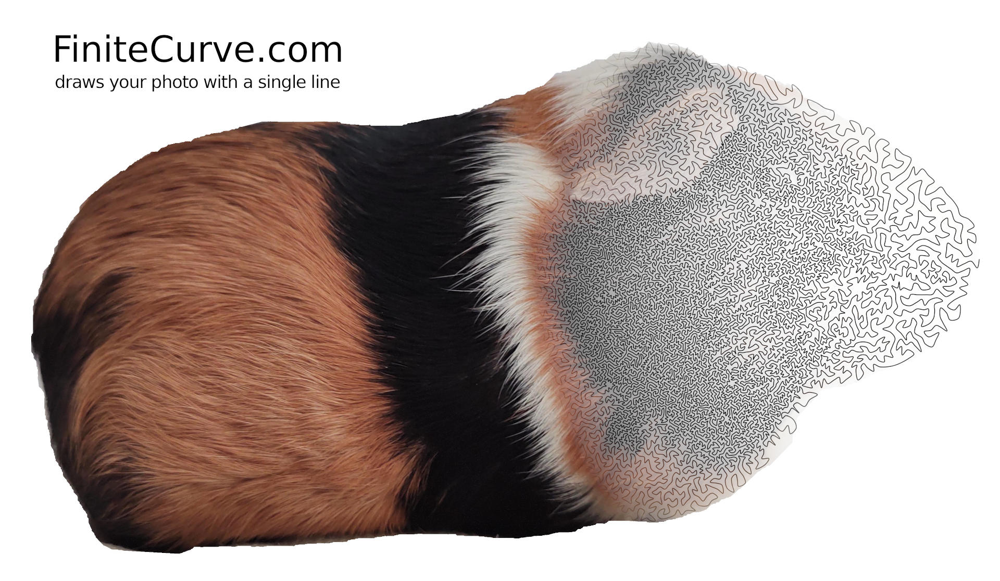

# FiniteCurve.com -- TSP art on a CPU budget

This is the code that powers [FiniteCurve.com](https://www.finitecurve.com), a
TSP art style generator without the NP-hard complexity.

For more info, see [the blog post](https://www.vidarholen.net/contents/blog/?p=1062)

The program was meant as a one-off generator for an art piece for my wall, but
the result was so captivating that I compiled it to wasm, slapped a React.js
frontend on it, and set up a domain name. The code quality reflects this origin.

To build a releasable version: `./buildall`

Interractive development frontend: `npm start`

License: GNU Affero General Public License v3 (AGPL3)

